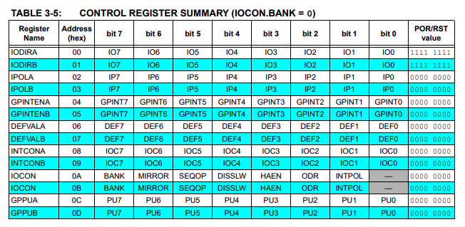
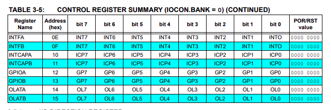
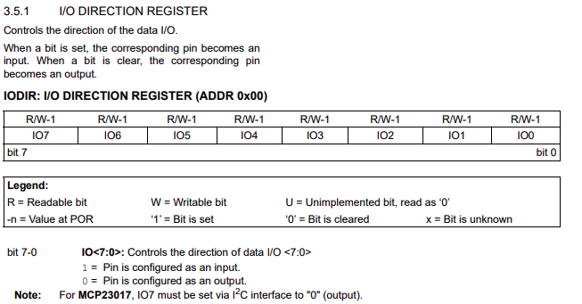
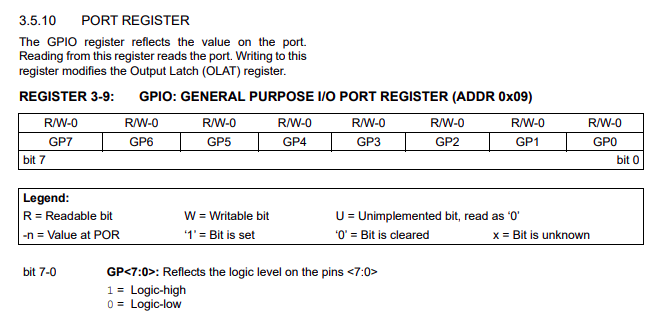

# Device Driver Tutorial
*Authors: Ben Everson, Wilson Guo, Bowen Quan, Aditya Yellapuntula Venkata*

## Introduction
Before writing any code for this tutorial, make sure you checkout a new branch with `git checkout -b ______`, where `_____` is the name of your branch. Including your name or username in the branch name is helpful for keeping track of who wrote which branch. 

### Objective
In this tutorial, you will write a driver that runs on the L432KC Nucleo microcontroller which can interface with the MCP23017 GPIO (General Purpose Input Output) expander via the I2C communication protocol. 

A GPIO expander provides additional pins which can be used to read input values or write output values. For example, you can write a 1 to a pin that's connected to an LED to turn it on, or read the value from a pin that's connected to a switch. This device is useful if you are already using all the GPIO pins on your microcontroller and need more GPIO pins. 

**(Read the "Optional Section" for an extra task)**

### Your tasks
* Complete the functions in [mcp23017.cpp](/src/mcp23017.cpp)
* Write test code in [main.cpp](/src/main.cpp) to turn on an LED attached to pin 7 and read in the value from a switch from pin 5. 

### More about the MCP23017 GPIO expander
The [datasheet](https://ww1.microchip.com/downloads/aemDocuments/documents/APID/ProductDocuments/DataSheets/MCP23017-Data-Sheet-DS20001952.pdf) has a lot of information about the registers of the MCP23017, their default values, and its I2C subordinate address. 

Here are a few sections of the datasheet that are really helpful for this tutorial: 

#### Registers

* Each register stores 8 bits of data.
* Each register has a specific address (or offset). (Ex. the GPIOA register has an address of 0x12)
* Since the MCP23017 has 2 banks, each type of register has an A register and a B register. (Ex. IODIRA and IODIRB) For this tutorial, we will only use **bank A**.

#### IODIR register
 
The I/O Direction register controls whether each individual pin should be configured as an input or an output. Each bit corresponds to an individual pin. 
* A bit set to 0 indicates the pin is an **output**.
* A bit set to 1 indicates the pin is an **input**.

#### GPIO register
 
The bits in the GPIO port register correspond to the value at each GPIO pin. 
* 0 means the pin is driven low.
* 1 means the pin is driven high.
* For an input pin, the MCP23017 will set the value of the bit to the level the pin is driven to. 
* For an output pin, we can write a 0 or a 1 to that bit to change the level of the pin. 

## I2C communication protocol
I2C communication is done between a monarch and one or more subordinates. In our case:
* the MCU (microcontroller unit) is the monarch
* the MCP23017 is the subordinate.

I2C subordinates have an address. This allows the monarch to communicate with multiple devices via I2C. To determine the **MCP23017's I2C address**, see this part of the datasheet:

A2, A1, A0 are the values tied to the address pins of the MCP23017. In the current hardware setup, they are all tied to GND (ground), which means they have a value of 0. 

### I2C write
The monarch will write: 
* the control word (I2C subordinate address with LSB=0)
* the register offset
* data (however many bytes)

### I2C read
The monarch will first write: 
* the control word (I2C subordinate address with LSB=1)
* the register offset 

Then, the monarch will read by:
* writing the control word (I2C subordinate address with LSB = 1)
* reading data (however many bytes you specify)

### Arduino I2C library
Here are a few functions from the Arduino library that will be useful for implementing I2C reads and writes: 
* [beginTransmission()](https://docs.arduino.cc/language-reference/en/functions/communication/wire/beginTransmission/?_gl=1*zwfibp*_up*MQ..*_ga*MzUyMjMyMTQuMTczNzkxNjI4Nw..*_ga_NEXN8H46L5*MTczNzkxNjI4NS4xLjAuMTczNzkxNjI4NS4wLjAuMzg2MTI0NDQ5)
* [endTransmission()](https://docs.arduino.cc/language-reference/en/functions/communication/wire/endTransmission/?_gl=1*cg87r0*_up*MQ..*_ga*MTcxNjg5MTU1Ni4xNzM3OTE2MzI1*_ga_NEXN8H46L5*MTczNzkxNjMyMy4xLjAuMTczNzkxNjMyMy4wLjAuMTAzNzcyMzU5Mw..)
* [write()](https://docs.arduino.cc/language-reference/en/functions/communication/wire/write/?_gl=1*1ljn3zo*_up*MQ..*_ga*MTE4MjQzMTQwMC4xNzM3OTE2MzQ0*_ga_NEXN8H46L5*MTczNzkxNjM0My4xLjAuMTczNzkxNjM0My4wLjAuNDQzOTkyODUw)
* [read()](https://docs.arduino.cc/language-reference/en/functions/communication/wire/read/?_gl=1*t2478n*_up*MQ..*_ga*NDIyNjc2NTkyLjE3Mzc5MTYxNzc.*_ga_NEXN8H46L5*MTczNzkxNjE3NS4xLjAuMTczNzkxNjE3NS4wLjAuMjcxMTAzNTE0)
* [requestFrom()](https://docs.arduino.cc/language-reference/en/functions/communication/wire/requestFrom/?_gl=1*1c94sf3*_up*MQ..*_ga*NTk0NjY0NDc4LjE3Mzc5MTYzNzE.*_ga_NEXN8H46L5*MTczNzkxNjM2OS4xLjAuMTczNzkxNjM2OS4wLjAuMTIwMjUxNjg3NA..)

### Note
 The data in an I2C message is always one or more **bytes** long. This means that we can't just tell the device to write or read a single **bit** of a register. We will always be dealing with all 8 bits, AKA a byte, at once.

### Optional Section
 In the begin() function you are expected to verify the I2C communication by comparing the value read from the IODIRA with its expected default. If you happen to code the way I do you will find that your code will fail and terminate everytime you reflash the micrcontroller or restart the program.  
   
 Why does it happen? The IOExpander's reset pin is not controlled by the code so the registers only reset their values when they lose power. This means that rerunning the program will not reset the IOExpander registers unless you drive its reset pin.  

 Uncomment the #define EXTERNAL_RESET_ENABLED and complete all the TODOs to finish this task. Do not change the wiring of the circuit, deducing which digital pin to use is also a part of this task.

 **Note**: I left out some important information to complete this task so that you can look through the datasheet and Nucleo L432KC's pinout.  

 [MCP32017 datasheet](https://ww1.microchip.com/downloads/aemDocuments/documents/APID/ProductDocuments/DataSheets/MCP23017-Data-Sheet-DS20001952.pdf)  
   
 [L432KC Pinout](https://os.mbed.com/platforms/ST-Nucleo-L432KC/)

## Hints for specific functions
### The constructor `Mcp23017::Mcp23017(int addr)`
* Record the device address. This will be used in the I2C reads and writes of other functions. 

 ### `get_dir()`
 This function should return the value of a specific pin's direction. To do this, we should:
 1. Specify to the MCP that we want to read from the IODIRA register from by writing the correct register offset.
 2. Read **ONE byte** from the IODIRA register we just specified.
 3. Do bitwise arithmetic to figure out what part of **the byte** corresponds to the pin we are looking for. 
 4. Return the value of the pin.

 **Hint:** The "and" (&) and "shift right" (>>) operators might be helpful to filter out the pin you are looking for.

### `get_state()`
 This function should do the same thing as `get_dir()`, except it reads from the GPIO register instead of the direction register. 
 
 **Hint**: We will read and write to these IODIR and GPIO registers a lot, so defining macros at the top for these values is a good idea!

### `set_dir()`
 This function should set the direction (input/output) of a given pin to a given value. 
 1. Find out which value (0 or 1) means "input" and which value means "output". It's a good idea to write a comment in the code for this to help anyone who will be using this driver in the future. 
 2. Remember that all I2C communication is done with bytes, so we can't write to specific bit in the register to change its value. Think about what we need to do to preserve the values of the other bits of the register. 
 3. We will need to use bitwise operations to set a certain bit position to a 0 or a 1. (Hint: the operations for 0s and 1s are different). 
 

### `set_state()`
Similar to how `get_dir` was nearly identical to `get_state`, `set_state` is going to be very similar to `set_dir` . There shouldn't be too many changes here.

### `begin()`
 This function should:
 * read and verify the default value of the IODIRA register to confirm I2C communication between the microcontroller and the MCP23017
 * set the direction of each pin on the MCP23017. Note that this function takes in an array of 8 integers called `directions`. These define the direction to be set for each pin in bank A.
 * return a 0 if the initialization is a success (default value of IODIRA is read correctly), 1 otherwise. 

It is a good idea to perform a verifiable I2C transaction to make sure everything is working correctly. Most I2C devices contain a register that holds what is called a Device ID number, but the MCP23017 doesn't. So, we will use the IODIRA register as our "Device ID" register instead. If we can read and verify the default value of the IODIRA register in the `begin` function, we can have confidence that our I2C communication is working properly. 

**Hint:** the default value of the IODIRA register is in the datasheet. 

## Writing test code
First, make sure the functions you implemented all compile by clicking the check mark at the bottom bar of VS Code. The target has already been set as the Nucleo L432KC. 

Second, open a Pull Request in this Github Repo. This way, the firmware lead can look over your code and give feedback.

To test on the hardware, you can write test code in [main.cpp](/src/main.cpp) that:
* initializes an `Mcp23017` object. (See the I2C section to learn how to determine the I2C address of the MCP23017) 
* calls `begin()` with an array specifying the directions of the pins (remember that the LED pin should be output and the switch pin should be input)
* turns the LED on and off, and reads the value of the switch in `loop()`. Don't forget to use a few [delay()](https://docs.arduino.cc/language-reference/en/functions/time/delay/) or your code will run super quickly!