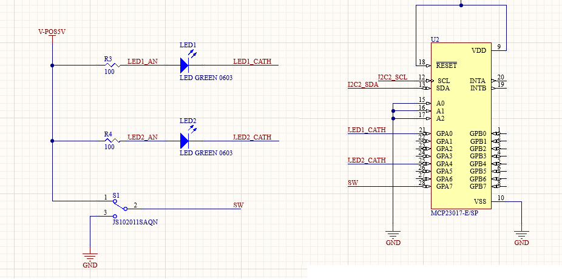

# Device Driver Tutorial
*Author: Ben Everson*

A hands-on introduction to Badgerloop embedded device driver architecture, development, and testing.

## Introduction

### What is a driver?

Driver is a very general term that can convey a few different meanings throughout the entire computer science community. You may be familar with drivers in relation to your personal computer. For example, you may have needed to install drivers for hardware peripherals like a mouse, printer, or GPU. These drivers are bits of software that are given to your Operating System so that it can properly access, modify, and manipulate that device.

Here at Badgerloop, we develop similar software. However, instead of writing code to make Windows interact with a keyboard, we write code so that the computers on our vehicle can interact with all of the devices and sub-systems that make it operate.

### What do our drivers look like?

All of our firmware is written in C++. We have developed an object oriented architecture that allows some of the more complex details of the system to be abstracted away and made more accessible to new members.

Every device or system that our computer needs to communicate with does so using a **Serial Communication Protocol (SCP)**. These protocols are like the language that is used when the computer is talking to a device or system. There are many different kinds of these protocols, and we use a variety of them here at Badgerloop.

The lowest level of our object oriented architecture is the SCP class. The goals of these classes are to provide the ability for our computers to speak these different languages. These classes are usually referred to as "serial communication drivers". 

Once we have a class that lets us utilize an SCP, we need to write code to decide what to actually say to the device. This will be the device class. Since each device uses an SCP to communicate, we can create a class that contains internally a respective SCP class. This will allow us to use the methods provided by the SCP class so we can speak the proper language. This tutorial will focus on developing the device class for the MCP23017.

## The Tutorial

### The MCP23017 IO Expander

The MCP23017 is an embedded device that is used to expand the **General Purpose Input/Output (GPIO)** capabilities of a system. GPIO pins are used to determine or control if a digital signal is a one or a zero. These signals are discrete and only exist in on/off states (left turn signal is on, brake is pressed, etc.). Most of the time, GPIO pins can be either read from or written to. We read from a GPIO pin when we want to determine what level an external source is driving the pin (is a switch on or off?). We write to a GPIO pin when we want to set the level of the pin (turn that LED on or off). Most microcontrollers or single board computers have a limited amount of GPIO pins built into them. An IO expander, like the MCP23017, allows the computer to control external GPIO pins via an SCP.

The MCP23017 has two banks of GPIO pins. Each bank is comprised of 8 pins that can be set to read the state of a pin driven by an external source (input) or to drive a pin high or low (output). This tutorial will involve writing code that configures the GPIO pins as inputs or outputs (pin direction) and reads from/writes to the pins depending on that direction. Take a look at the file [include/mcp23017.h](include/mcp23017.h). This contains function declarations for a class called Mcp23017. You will be implementing each of these functions later in the tutorial. Take a look at the signatures of each function. Can you think of what some of these functions will do, at a high level, based on their names?

The MCP23017 uses a serial communication protocol called I2C. The specifics of the protocol are outside the scope of this tutorial, but you can read more about it [here](https://ece353.engr.wisc.edu/serial-interfaces/i2c/). There are a few key characteristics of the protocol that are important to understand when developing the device driver, however. Communication between the computer and device happens on what is called a **bus**. The computer we will use in this tutorial, for example, has four I2C buses. The bus acts like a street that devices can be placed on. Each device on the bus has a specific address programmed into it. When the computer wants to send a message to a device, it needs to know two things: the bus the device is connected to and the address of the device. When it wants to send data to a device, it forms a message with the address appended to the front of the data and sends it out onto the bus. Every device on the bus can hear this message, but only the device at the requested address will listen to it. The devices on the bus will only send messages back to the computer if they are specifically requested to by the computer.

So what do these messages look like? How do we tell a device to behave a certain way? How do we request a device to send us certain data? To do this, we need to take a look at the device's datasheet. This is a document created by the device's manufacturer. It includes pretty much every possible bit of information you need to know about the device. For the sake of this tutorial, I will be including screenshots from the relevant sections of the datasheet. I would recommend taking a look at the MCP23017 [datasheet](https://ww1.microchip.com/downloads/aemDocuments/documents/APID/ProductDocuments/DataSheets/MCP23017-Data-Sheet-DS20001952.pdf), as being able to find the relevant information is an important skill.

The MCP23017, as well as most I2C devices we use, uses a set of registers to expose the device to the I2C bus. If the I2C bus is a street and the device is an office building at an address on that street, each register is like a specific office inside of that building. When we want to tell a device to do something, set a GPIO pin to be an input, for example, we need to send a certain message to the correct register in the device. The device's datasheet contains the information for what this message should look like and what register we should send it to. Take a look at the following screenshot from the MCP23017 datasheet:

This is a list of every register in the MCP23017. As you can see, each register stores 8 different bits of data, and each register is associated with a specific address. You also might notice that there two identical registers each labeled A and B. This is because the MCP23017 has two banks of 8 GPIO pins. For the sake of this tutorial, however, we are going to be ignoring bank B. Now that we know what each register looks like, we need to figure out how each register functions. Here are the two registers we will need to interact with for this tutorial:  
 
The I/O Direction register controls whether each individual pin should be configured as an input or an output. Each bit corresponds to an individual pin. Note that a bit being set to 1 indicates that the corresponding pin is an *input*, and a bit being set to 0 indicates that the corresponding pin is an *output*. This register will be used at the creation of the object in software to set all of the pins to their required directions.
   
 
The bits in the GPIO port register correspond to the level of each GPIO pin. As you can see in the description at the bottom of the image, a one means the pin is driven high and a zero means the pin is driven low. For each pin that is an input, the device will set the value of each bit to whatever level the pin is driven to. If the pin is configured as an output, we will be able to write that bit to a zero or a one to physically change the level of the pin. We will use this register to read from the device's input pins and set its output pins.

### Writing Code (Finally!)

I know that was a lot of information, but now you should understand the mechanisms we are going to use to interact with the pins on our MCP23017. This section of the tutorial will involve implementing functions to configure, monitor, and control the pins on an MCP23017. 

 Let's start by looking at the I2C serial communication class. Take a look at the definition of the I2C class in the [MbedOS API](https://os.mbed.com/docs/mbed-os/v6.15/apis/i2c.html). Since the Mcp23017 class will contain an instance of the I2C class, it's important to unerstand the protected methods we will have at our disposal. These methods are already implemented, but we will be using them to actually send messages on the I2C bus. The two important methods we will use in this tutorial are the `write (int address, const char *data, int length, bool repeated=false)` method and the `read (int address, char *data, int length, bool repeated=false)`.
 
 **Note**: The data in an I2C message is always one or more bytes long. This means that we can't just tell the device to write or read a single bit of a register. We will always be dealing with all 8 bits, AKA a byte, at once.

 Now that we know what functions we will use to read and write the MCP23017 registers, we can start implementing the functions defined in [include/mcp23017.h](include/mcp23017.h). The stubs are layed out for you in [src/mcp23017.cpp](src/mcp23017.cpp). If you feel confident in implementing these functions, give it a try! Feel free to skip to [Testing](#testing) section once you are done. If you still feel like you need some help, I will go over each of these methods one by one.

 **Note:** You will see a data type, `uint8_t`, that might not be familiar to you. This data type represents an unsigned 8 bit integer (a byte). It will be used whenever we are dealing with register addresses and values.

 **The Constructor** 
 This function simply needs to record the identifying information that we pass in (the device address) and store the I2C instance that we use to access the bus. You will see how we use these members later when we access the device. 

 **`get_dir`** 
 This function should return the value of a specific pin's direction. To do this, we will need to do a few things. First, we need to first specify to the MCP what register we want to read from by writing the proper register offset to it. Second, we will need to read from the iodir register we just specified. Third, since we have to read the value of the entire register (remember we can't just read one bit), we have to do some bitwise arithmetic to figure out what part of the byte we read corresponds to the pin we are looking for. Finally, we can return that value.

 **Hint:** You might find use for the and (&) and shift right(>>) operators to filter out the pin you are looking for.

 **`get_state`** 
 This function is going to be doing the same thing as `get_dir`, except we will be reading from the GPIO register instead of the direction register. 
 
 **Hint**: We're going to be reading and writing to these iodir and GPIO registers a lot. Instead of referencing the datasheet every time we need to know the address, it might be helpful to define macros at the top for these values.

 **`set_dir`** 
 This function is going to set a given pin number to a given value. We will need to do some logic to determine what byte to send to the device in order to configure the correct pin. Think about what bitwise operations you need to use to set a certain bit position to a zero or a one. Then, you can send that byte to the iodir register.

 **WARNING**: Remember that you have to write an entire byte of data to the register. Think about what effects this might have.

 **`set_state`** 
 Similar to how `get_dir` was nearly identical to `get_state`, `set_state` is going to be very similar to `set_dir` . There shouldn't be too many changes here.

 **`begin`** 
 This function is responsible for confirming I2C communication between the computer and the device, as well as setting the direction of each pin on the device. While all of the I2C initialization is handled by the `I2C` class, it is often a good idea to perform a verifiable I2C transaction to make sure everything is working correctly. Most I2C devices contain a register that holds what is called a Device ID number. Look in the datasheet and see if you can find this register and the corresponding ID number for the MCP23017. If we can read and verify this number in the `begin` function, we can have confidence that our I2C communication is working properly. You will also be setting the direction of each pin using the function(s) you implemented above. Note that this function takes in an array of 8 integers called `directions`. These will correspond to the direction of each pin in the device's bank.

 ## Testing
 So you wrote your driver, but now you have to test it. The first step you should take is to make sure the functions you implemented all compile. You can do this by clicking the hammer; make sure that you have chosen `driver-dev-tutorial` as the current project and `Nucleo-F767ZI` as the target. You will have to take some time working through any syntax errors you have. It might get a little frustrating, especially if you aren't very familiar with C++. Feel free to reach out in the firmware channel if you get stuck on anything specific.

Now that you have a device class that compiles, you can write code to test your functions. This code should be in the `main` function in [main.cpp](main.cpp). Assume the MCP23017 is connected like so:

**Note**: This circuit diagram is meant to only convey the connections of the MCP23017 GPIO pins. Not the entire surrounding circuit.

As you can see, two LEDs are tied to pins 0 and 4. There is also a switch connected to pin 7. Can you initialize an Mcp23017 object and use the functions you implemented to turn the LEDs on and read the position of the switch?

We will try to schedule times to get you running your code on this hardware setup. :)
